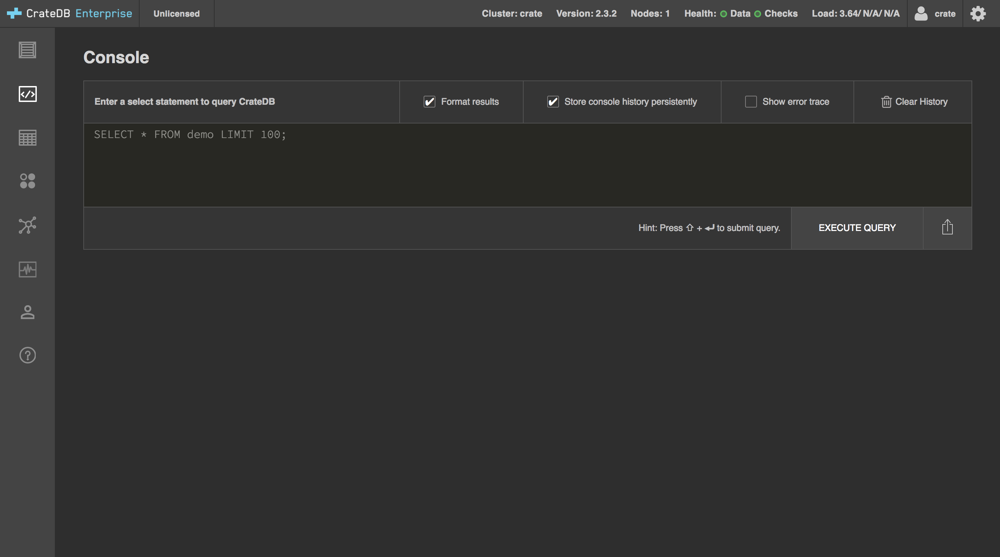
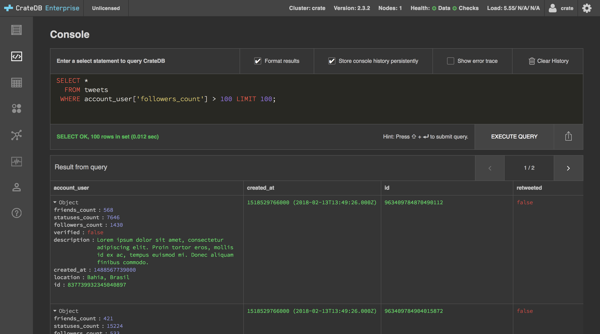

.. _query-test-data:

======================
The Basics of querying
======================

CrateDB uses `regular SQL`_ for queries.

In this document, we show you the basics of how to query CrateDB using SQL.

.. NOTE::

   This document assumes that you have CrateDB :ref:`installed and
   running<install-run>` and that you have :ref:`imported some test data
   <import-test-data>`.

.. rubric:: Table of contents

.. contents::
   :local:

Query your tweets
=================

One of the easiest ways to query CrateDB is with the query console in the
CrateDB admin UI.

:ref:`Open up the admin UI <admin-ui>`.

Select the *Console* tab from the left-hand navigation menu.

You should see something like this:

In the previous document, we imported some tweets from the public Twitter
timeline.

If you want know more about the ``tweets`` table, select the *Tables* tab from
the left-hand navigation menu. This screen will show you the table `schema`_.

For an example query, why don't we filter those tweets so that we're only
looking at tweets from people with more than 100 followers. We can do that with
a query like so:

.. code-block:: psql

    SELECT *
      FROM tweets
     WHERE account_user['followers_count'] > 100
     LIMIT 100;

The ``tweets`` table has a column named ``account_user``. The ``account_user``
is an `object`_, and can be queried into by specifying object attributes. In
the query above, we're matching rows where the ``followers_count`` attribute of
this object is more than ``100``.

Type this query into the admin UI query console. Then select *EXECUTE QUERY*.

You should see something like this:

CrateDB's SQL support includes distributed `aggregation`_, `scalar`_ functions
and `geospatial`_ support for more complex queries and data analysis. CrateDB
also comes with `fulltext search`_.

.. SEEALSO::

   Consult `the CrateDB query reference`_ for documentation on the full range
   of query capabilities.

Taking it further
=================

Before we take a look at client libraries for CrateDB, let's take a quick look
at three additional ways you can query CrateDB.

The CrateDB Shell
-----------------

The CrateDB Shell (aka `Crash`_) is a command-line shell.

First, you must `install Crash`_.

Then, you can start the shell like so:

.. code-block:: console

   sh$ crash

This will automatically connect to CrateDB running on ``localhost``.

From here, you can execute queries against CrateDB by typing them and hitting
:kbd:`Enter`.

Let's try something new.

Type out the following query:

.. code-block:: psql

     SELECT account_user['followers_count']
       FROM tweets
   ORDER BY account_user['followers_count'] DESC
      LIMIT 10;

As you type, you may notice that Crash comes with autocompletion.

Here, we're ordering by follower count from highest to lowest, and then
selecting the top 10 values.

Hit :kbd:`Enter`.

You should see something like this:

.. code-block:: text

   +---------------------------------+
   | account_user['followers_count'] |
   +---------------------------------+
   |                         1416583 |
   |                         1076527 |
   |                         1025614 |
   |                          886577 |
   |                          854054 |
   |                          818439 |
   |                          795778 |
   |                          761014 |
   |                          740071 |
   |                          673962 |
   +---------------------------------+
   SELECT 10 rows in set (0.003 sec)

The CrateDB HTTP endpoint
-------------------------

CrateDB provides a `HTTP endpoint`_.

.. TIP::

   If you're not familiar with HTTP APIs, feel free to skip this section.

Let's run another query:

.. code-block:: psql

   SELECT COUNT(*) FROM tweets

This time, all we want to know is how many tweets we have.

Using `HTTPie`_, you can run this query against CrateDB listening on
``localhost:4200``, like so:

.. code-block:: console

   sh$ http localhost:4200/_sql stmt="SELECT COUNT(*) FROM tweets"

CrateDB will respond using ``JSON``. You should see something like this:

.. _JSON: https://www.json.org/

.. code-block:: text

   HTTP/1.1 200 OK
   content-length: 71
   content-type: application/json; charset=UTF-8

   {
       "cols": [
           "count(*)"
       ],
       "duration": 11.847271,
       "rowcount": 1,
       "rows": [
           [
               3879
           ]
       ]
   }

In this example, we have a single row with a single column: ``3879``.

Third-party client tools
------------------------

The admin UI and Crash are the two client tools that ship with CrateDB. But
those are not the only client tools you can use with CrateDB. Because CrateDB
uses the PostgreSQL wire protocol, many PostgreSQL compatible client tools work
with CrateDB.

.. SEEALSO::

    The `client tools`_ category on our blog.

Next steps
==========

Now you know how to query CrateDB manually, it's time to :ref:`find a client
library and start building <start-building>`.

.. _aggregation: https://crate.io/docs/crate/reference/en/latest/general/builtins/aggregation.html
.. _client tools: https://crate.io/a/category/integrations/
.. _Crash: https://crate.io/docs/clients/crash/en/latest/
.. _fulltext search: https://crate.io/docs/crate/reference/en/latest/general/dql/fulltext.html
.. _geospatial: https://crate.io/docs/crate/reference/en/latest/general/ddl/data-types.html#geo-point
.. _HTTP endpoint: https://crate.io/docs/crate/reference/en/latest/interfaces/http.html
.. _HTTPie: https://httpie.org/
.. _install Crash: https://crate.io/docs/clients/crash/en/latest/getting-started.html
.. _object: https://crate.io/docs/crate/reference/en/latest/general/ddl/data-types.html#object
.. _regular SQL: https://crate.io/docs/crate/reference/en/latest/appendices/compatibility.html
.. _scalar: https://crate.io/docs/crate/reference/en/latest/general/builtins/scalar.html
.. _schema: https://crate.io/docs/crate/reference/en/latest/general/ddl/create-table.html#schemas
.. _the CrateDB query reference: https://crate.io/docs/crate/reference/en/latest/general/dql/index.html
